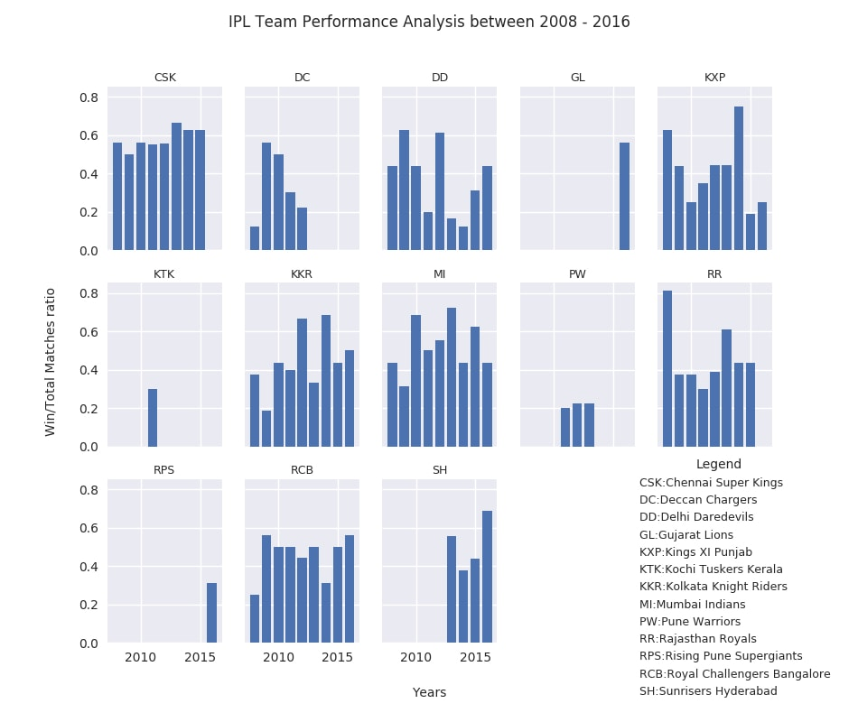

# IPL-Team-Performance
Performance Analysis for IPL Teams by calculating their win ratio between the period 2008-2016, and concluding arguments like which are the most consistent teams, most seasons played by a team etc.

Operations performed
1. Data Manipulation and Cleaning - Pandas and numpy
2. Data Visualization - Matplotlib and Seaborn

### Dataset:
URL: https://www.kaggle.com/imrankhan17/t20matches

### Plot: 

### Plot understanding
The visualization addresses the question of how the performance of teams have varied in the IPL across 2008-2016. Two datasets were used for this purpose: 
1. Dataset which had entries for all t20 series conducted from 2003 - 2017. Using this dataset the series_id was found for all IPL tournaments during the period. 
2. The second dataset included entries for all t20 matches conducted from 2003 - 2017. Using the series_id's for IPL tournaments, all IPL matches were scrapped and loaded into the dataframe. 
 
Tie games, no result matches, abandoned matches were dropped from the analysis to provide a more level comparison. A year by year bar chart has been plotted to help reader identify the trends of the win ratios. The plot indicates that teams like Chennai Super Kings, Mumbai Indians and Royal Challengers Bangalore to have consistent performances across the time frame, with Chennai being the most consistent of the lot. There are even teams like Kolkata Knight Riders, Rajasthan Royals, and Kings XI Punjab who have delivered performances but couldn't maintain the consistency throughout. The plot also allows the readers to visualize that there have been teams which have not played many seasons like Gujarat Lions etc. Thus it can be concluded that Chennai Super Kings have been the most consistent performer, and Delhi Daredevils the under-performer in most of the seasons.

### Features of the visualization [According to Cairo's Principles]
##### Truthfulness 
The x axis and y axis have been shared to prevent readers from misleading. This gives perfect understanding of how the teams have performed. 

##### Beauty 
The plot has been kept simple, and each result has been showed on a different sub-plot to avoid any clutter. 

##### Functionality 
Priority has been given to displaying the results rather than having artistic embellishments and deviating the user. 

##### Insightfulness 
The problem statement designed was to analyze the performance of teams in IPL across 2008-2016, which has been depicted clearly, with teams performing consistently are clearly separated from the teams under-performing. Teams which have been regular part of majority seasons can also be viewed from the visualization.